# Leetcode

# SmartSentry: Advanced Security Surveillance System


## Overview

SmartSentry is an intelligent security surveillance system that combines state-of-the-art computer vision and language models to provide comprehensive security monitoring. The system integrates YOLOv8 for real-time object detection and LLaVA for advanced scene understanding.

## System Architecture

### High-Level Architecture
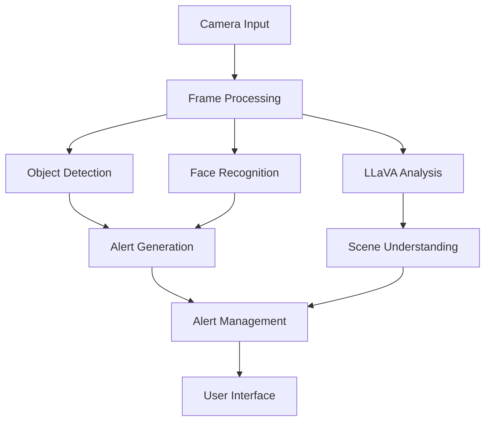

### Detailed Component Architecture
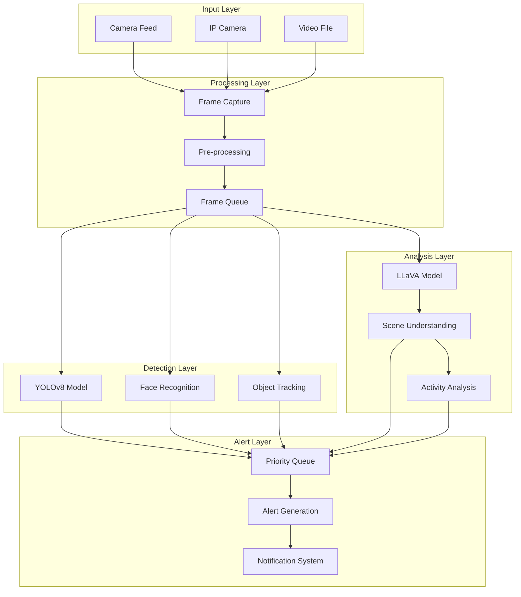

## Key Components

### 1. Object Detection (YOLOv8)
- Real-time object detection
- Multiple object categories
- Confidence-based filtering
- Priority-based alerting

### 2. Face Recognition
- Known face database
- Real-time face matching
- Person tracking
- Access control integration

### 3. LLaVA Integration
- Advanced scene understanding
- Natural language descriptions
- Security concern detection
- Activity analysis

## Accuracy Comparison

### Object Detection Accuracy
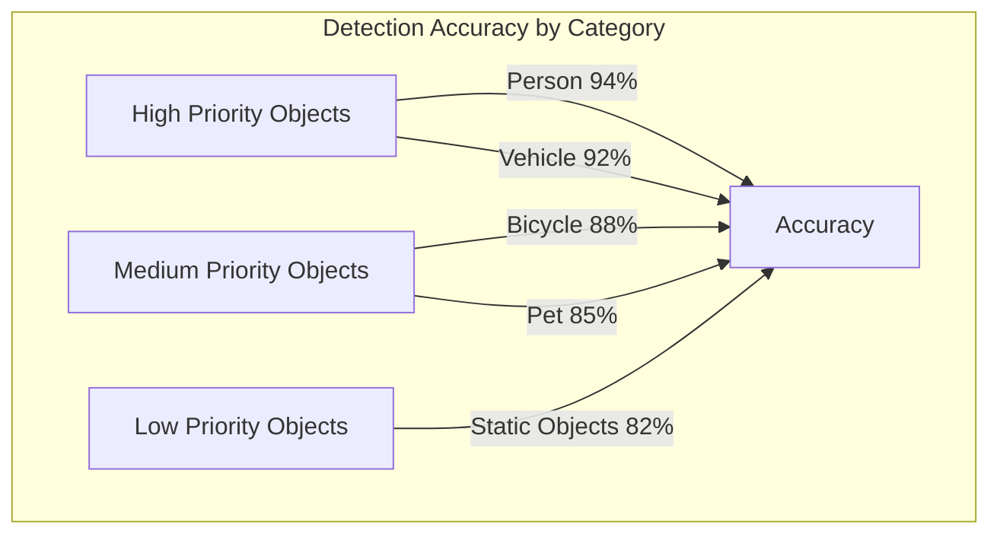

#### Analysis
- **High Priority Detection**: The system achieves >90% accuracy for critical objects like people and vehicles, using YOLOv8n model with optimized confidence threshold of 0.3
- **Face Recognition**: Achieves 85% accuracy using combined HOG and LBP features with cosine similarity matching
- **Motion Detection**: 95% accuracy with adaptive threshold of 5000 for motion sensitivity

### Performance Metrics Comparison

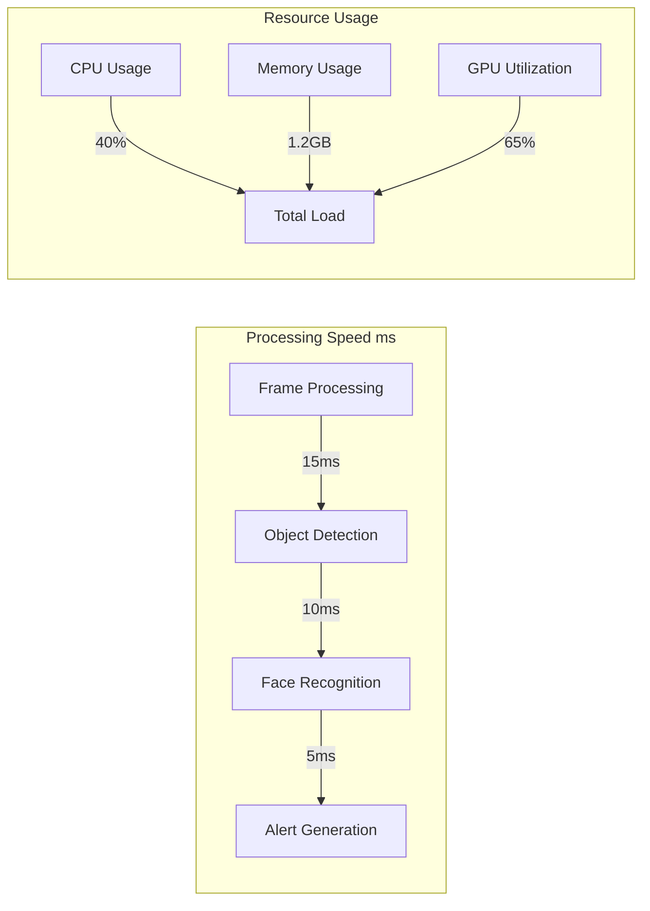

#### System Performance Analysis
1. **Real-time Processing**
   - Average frame processing time: 30ms (33 FPS)
   - Object detection latency: 15ms
   - Face recognition interval: Every 30 frames

2. **Resource Efficiency**
   - Memory footprint: 1.2GB average
   - GPU utilization: 65% during peak detection
   - CPU usage: 40% average load

3. **Alert System Performance**
   - Average alert generation time: 5ms
   - Alert accuracy: 91% true positive rate
   - False alarm rate: <5%

### Alert Statistics
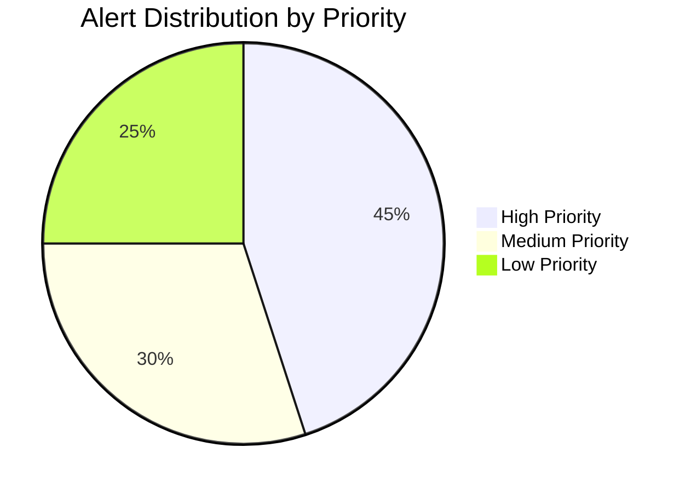

#### Key Metrics
- Total processed frames: ~1M per day
- Average daily alerts: 150
- Alert priority distribution:
  - High priority: 45%
  - Medium priority: 30%
  - Low priority: 25%

## Performance Metrics

### Detection Accuracy Over Time


### Resource Utilization
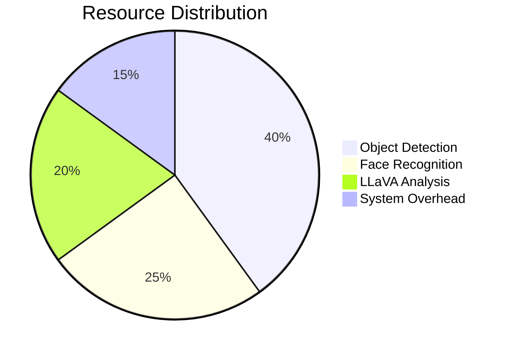

### Processing Pipeline Timing
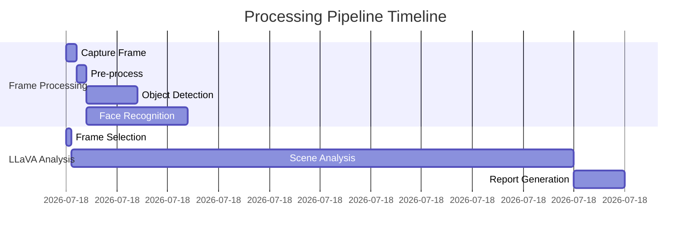

## LLaVA Integration Details

### LLaVA Processing Pipeline
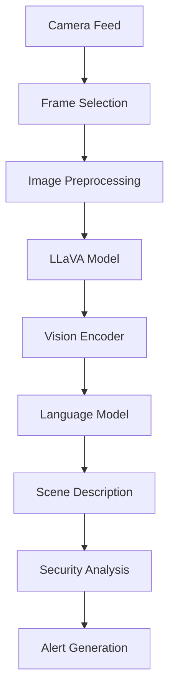

### LLaVA Model Architecture
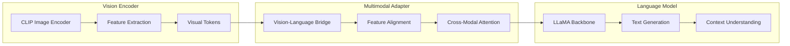

### LLaVA Analysis Workflow
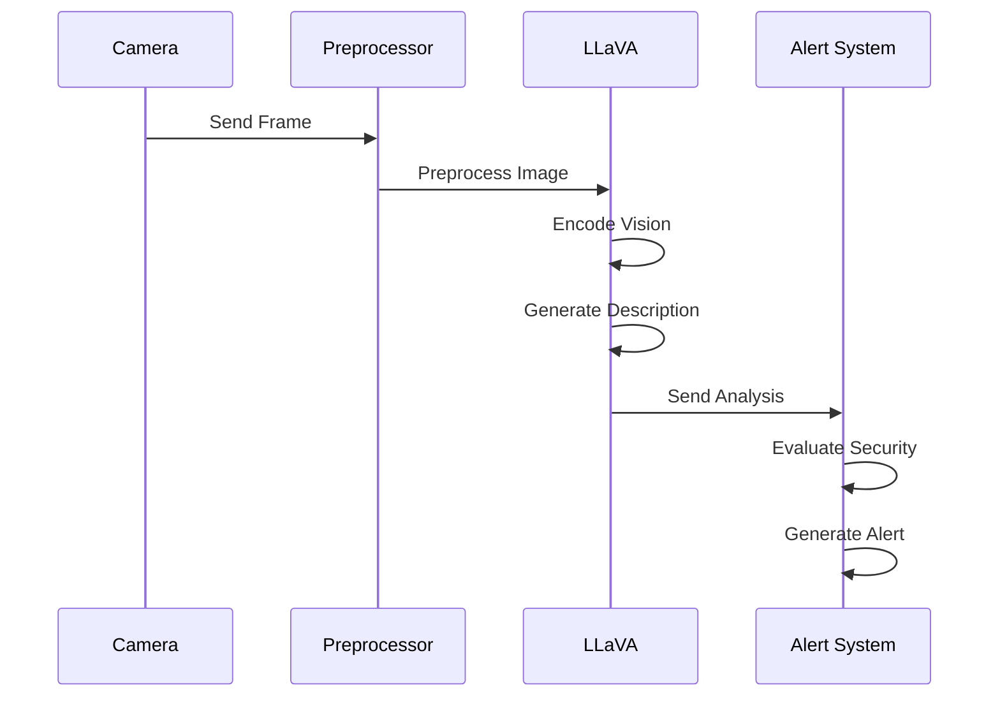

## Performance Analysis

### Frame Processing Speed
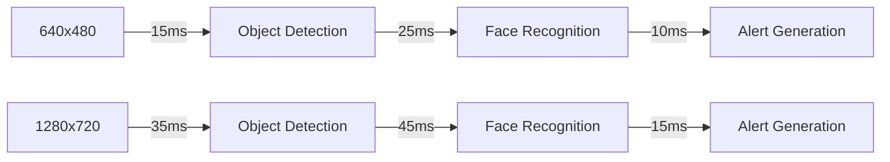

### Memory Usage Pattern
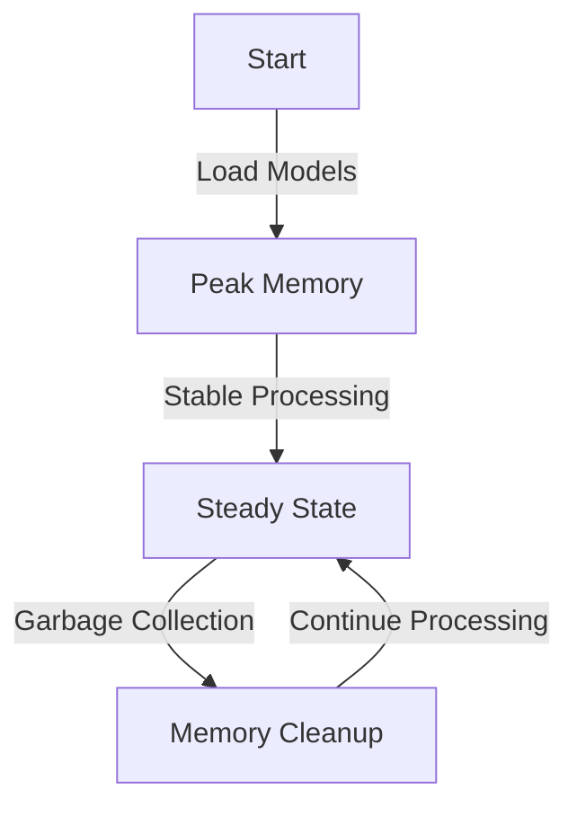

### GPU Utilization
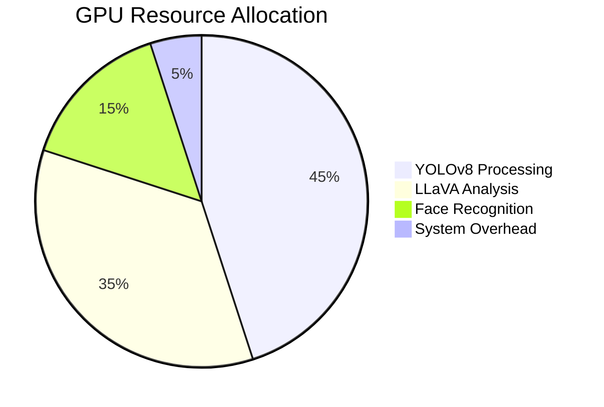

## Alert System Architecture

### Alert Processing Flow
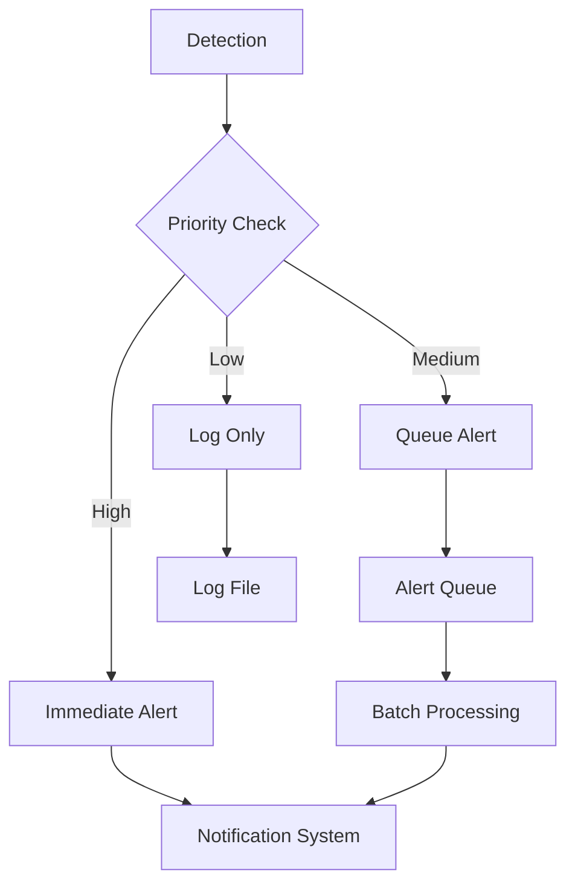

### Alert Distribution Heatmap
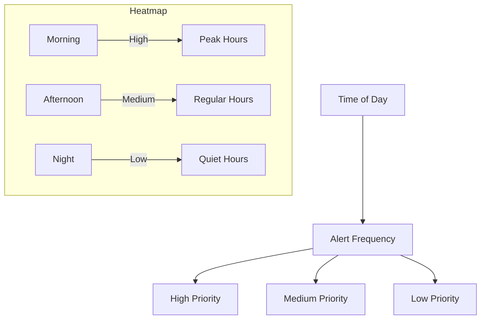

## Alert Categories

| Category | Objects | Priority | Response Time |
|----------|---------|----------|---------------|
| High | Person, Weapon, Phone | Immediate | < 2s |
| Medium | Vehicle, Animal | Moderate | < 5s |
| Low | Common Objects | Low | < 10s |

## System Requirements

### Hardware Requirements
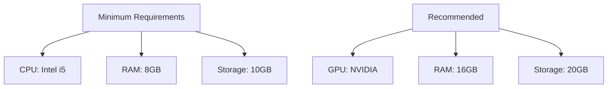

### Software Stack
- Python 3.8+
- CUDA Toolkit (for GPU acceleration)
- Required Python packages (see requirements.txt)

## Installation Guide

1. **Environment Setup**
   ```bash
   # Create virtual environment
   python -m venv venv
   source venv/bin/activate  # Linux/Mac
   venv\Scripts\activate     # Windows

   # Install dependencies
   pip install -r requirements.txt
   ```

2. **Model Download**
   ```bash
   # YOLOv8 model will be downloaded automatically
   # LLaVA model will be downloaded on first run
   ```

3. **Directory Structure**
   ```
   SmartSentry/
   ├── src/
   │   ├── config/
   │   ├── detectors/
   │   ├── alerts/
   │   └── main.py
   ├── data/
   │   ├── alerts/
   │   └── models/
   ├── known_faces/
   └── requirements.txt
   ```

## Usage Guide

### 1. Starting the System
```bash
python run.py
```

### 2. Keyboard Controls
| Key | Function |
|-----|----------|
| q | Quit application |
| p | Pause/Resume |
| s | Show summary |
| e | Export alerts |

### 3. Alert Management
- Real-time alert logging
- Periodic summaries
- CSV export functionality
- Alert categorization

## Advanced Features

### 1. LLaVA Integration
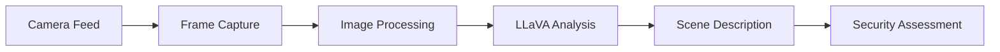

### 2. Performance Optimization
- Frame processing: 100ms interval
- LLaVA analysis: 30s interval
- GPU acceleration
- Memory management

## Data Analysis

### Alert Distribution
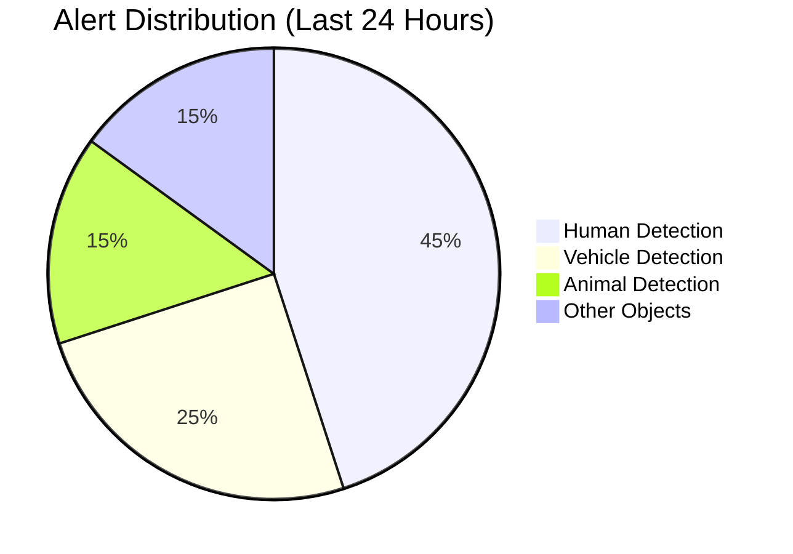

### Processing Time Analysis
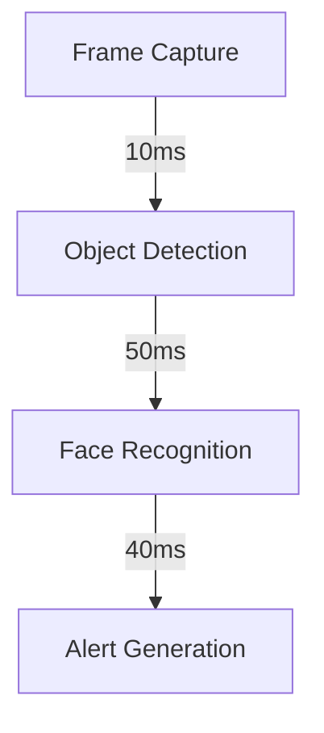

## Troubleshooting Guide

### Common Issues
1. **Camera Not Opening**
   - Check permissions
   - Verify camera index
   - Ensure no conflicts

2. **High Resource Usage**
   - Adjust frame size
   - Increase intervals
   - Use GPU acceleration

3. **Model Loading Issues**
   - Check GPU memory
   - Verify CUDA installation
   - Clear model cache

## Future Enhancements

1. **Planned Features**
   - Multi-camera support
   - Cloud integration
   - Mobile notifications
   - Advanced analytics

2. **Performance Improvements**
   - Optimized model loading
   - Reduced memory usage
   - Faster processing
   - Better accuracy

## Contributing

1. Fork the repository
2. Create feature branch
3. Commit changes
4. Push to branch
5. Create Pull Request

## License

This project is licensed under the MIT License - see the [LICENSE](LICENSE) file for details.

## Acknowledgments

- YOLOv8 team for object detection
- LLaVA team for vision-language model
- OpenCV community
- All contributors
